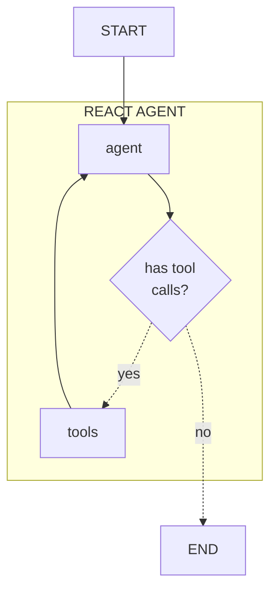
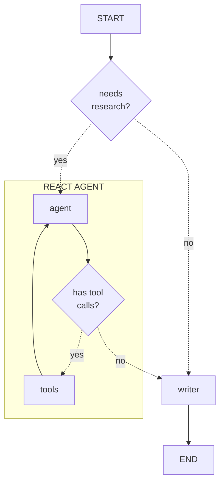
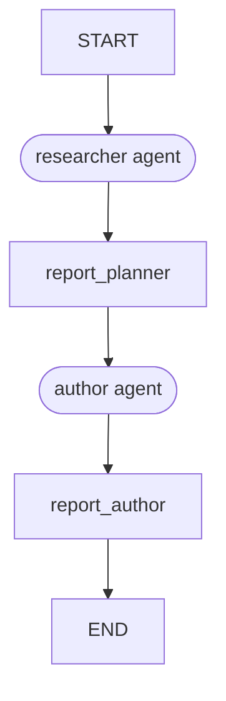

# Learn the Code

Want to make this agent your own? Let's dive into the code!
There are a few components in this agent, but we can break them down, one at a time.

Ready to get started? Let's start off by building the smallest components until we have everything we need.

<!-- fold:break -->

## Available Tools

The first step in creating an agent is defining the tools.
Tools are functions that define the actions an agent can take.
These functions allow agents to interact with external systems.

Your agent will only be able to generate text or perform the tasks defined tools.

We will define our tools in
<button onclick="openOrCreateFileInJupyterLab('code/docgen_agent/tools.py');"><i class="fa-brands fa-python"></i> code/docgen_agent/tools.py</button>.

For our use case, we only need to allow our agent to search Tavily. We have called this tool
<button onclick="goToLineAndSelect('code/docgen_agent/tools.py', 'def search_tavily');"><i class="fas fa-code"></i> search_tavily</button>.
Notice the detailed documentation for this function. This is a [Google formatted docstring](https://google.github.io/styleguide/pyguide.html#383-functions-and-methods) and can be used to define extra metadata for the agent.

Additional tools could be added to this file for use later use by our agent.

<!-- fold:break -->

## Topic Research Agent

Now that our tools are defined, we can create a simple agent to reserach a topic.

One of the simplest architectures for tool calling is called ReAct, short for Reasoning + Action.

In this architecture, the agent will reason what actions to take, preform those actions, and then reason on the next steps.
This is repeated until the agent decides there is no further action to take.

<!-- fold:break -->

This architecture has been implemented for basic research in
<button onclick="openOrCreateFileInJupyterLab('code/docgen_agent/researcher.py');"><i class="fa-brands fa-python"></i> code/docgen_agent/researcher.py</button> and is represented in this diagram.

<!-- fold:break -->

The agent's state definition is called
<button onclick="goToLineAndSelect('code/docgen_agent/researcher.py', 'class ResearcherState');"><i class="fas fa-code"></i> ResearcherState</button>.
The `state` object is passed to each node in the graph.

Each node in the graph manipulates the state using a function:
- **agent:** <button onclick="goToLineAndSelect('code/docgen_agent/researcher.py', 'def call_model');"><i class="fas fa-code"></i> call_model</button>
- **tools:** <button onclick="goToLineAndSelect('code/docgen_agent/researcher.py', 'def tool_node');"><i class="fas fa-code"></i> tool_node</button>
- **has tool calls?:** <button onclick="goToLineAndSelect('code/docgen_agent/researcher.py', 'def has_tool_calls');"><i class="fas fa-code"></i> has_tool_calls</button>

The graph is built and saved to
<button onclick="goToLineAndSelect('code/docgen_agent/researcher.py', 'graph =');"><i class="fas fa-code"></i> graph</button>.

If you would like to experiment with this agent, a
<button onclick="openOrCreateFileInJupyterLab('code/researcher_client.ipynb');"><i class="fa-solid fa-flask"></i> Researcher Agent Client</button> playground is avilable.

<!-- fold:break -->

## Section Author Agent

Simple ReAct agents are very powerful, but are often times combined with additional steps to do more complicated workflows.

The Section Author agent will need to perform additional research, but only when requested. Once the necessary research is available, it must use that research to write the section.

<!-- fold:break -->

Notice the architecture below. A gating function has been added before the ReAct style agent. An additional step has also been added after the ReAct agent to do the writing. This has been created in
<button onclick="openOrCreateFileInJupyterLab('code/docgen_agent/author.py');"><i class="fa-brands fa-python"></i> code/docgen_agent/author.py</button>.

<!-- fold:break -->

The agent's state definition is called
<button onclick="goToLineAndSelect('code/docgen_agent/author.py', 'class SectionWriterState');"><i class="fas fa-code"></i> SectionWriterState</button>.
The `state` object is passed to each node in the graph.

Each node in the graph manipulates the state using a function:
- **needs research?:** <button onclick="goToLineAndSelect('code/docgen_agent/author.py', 'def needs_research');"><i class="fas fa-code"></i> needs_research</button>
- **agent:** <button onclick="goToLineAndSelect('code/docgen_agent/author.py', 'def research_model');"><i class="fas fa-code"></i> research_model</button>
- **tools:** <button onclick="goToLineAndSelect('code/docgen_agent/author.py', 'def tool_node');"><i class="fas fa-code"></i> tool_node</button>
- **has tool calls?:** <button onclick="goToLineAndSelect('code/docgen_agent/author.py', 'def has_tool_calls');"><i class="fas fa-code"></i> has_tool_calls</button>
- **writer:** <button onclick="goToLineAndSelect('code/docgen_agent/author.py', 'def writing_model');"><i class="fas fa-code"></i> writing_model</button>

The graph is built and saved to
<button onclick="goToLineAndSelect('code/docgen_agent/author.py', 'graph =');"><i class="fas fa-code"></i> graph</button>.

If you would like to experiment with this agent, an
<button onclick="openOrCreateFileInJupyterLab('code/author_client.ipynb');"><i class="fa-solid fa-flask"></i> Author Agent Client</button> playground is avilable.

<!-- fold:break -->

## Top Level Architecture

Using these two agents, we can now put together our Document Generation Agent's workflow.

The Document Generation agent is actually the simplest yet, is is just a linear workflow! We simply need to research the topic, plan the document outline, write the sections, and compile the whole report. Easy!

<!-- fold:break -->

 Compare this diagram to the <button onclick="goToLineAndSelect('code/sample_searching_agent/agent.py', 'graph =');"><i class="fas fa-code"></i> graph definition</button> code.

Each node in this graph has an associated function, defined in the same file. Two nodes in our graph are sub-agents.

*researcher agent* is the first node in our graph and is defined in <button onclick="goToLineAndSelect('code/sample_searching_agent/agent.py', 'def topic_research');"><i class="fas fa-code"></i> topic_research</button>. This node invokes the researcher subgraph, that adds topic research to the message log.

<!-- fold:break -->

## Prompts

