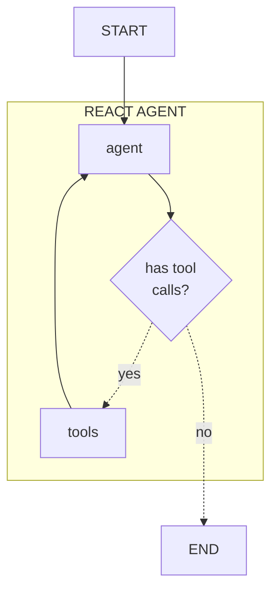
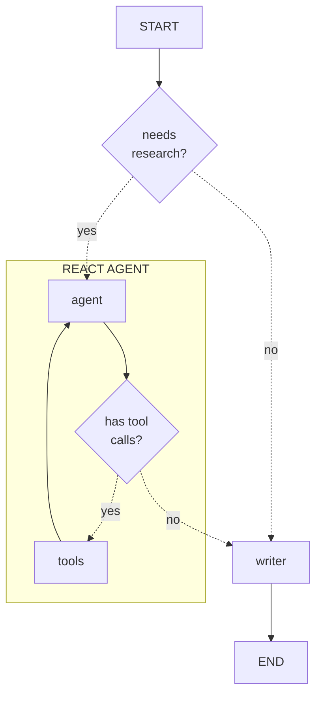

# Learn the Code

Want to make this agent your own? Let's dive into the code!
There are a few components in this agent, but we can break them down, one at a time.

Ready to get started? Let's start off by building the smallest components until we have everything we need.

<!-- fold:break -->

## Tavily Tool

The first part of any agent is the set of tools. 
Tools are functions that define the actions an agent can take.
These functions allow agents to interact with external systems.

For our use case, we want to allow our agents to search Tavily.
This tool is defined in `tools.py` and is called 
<button onclick="goToLineAndSelect('code/sample_searching_agent/tools.py', 'async def search_tavily');"><i class="fas fa-code"></i> search_tavily</button>.

<!-- fold:break -->

## Topic Research Agent

<!-- fold:break -->

## Section Author Agent

<!-- fold:break -->

## Top Level Architecture

At a the highest level, the research agent graph is a reasonably linear process. Compare this diagram to the <button onclick="goToLineAndSelect('code/sample_searching_agent/agent.py', 'graph =');"><i class="fas fa-code"></i> graph definition</button> code.

Each node in this graph has an associated function, defined in the same file. Two nodes in our graph are sub-agents. 

*researcher agent* is the first node in our graph and is defined in <button onclick="goToLineAndSelect('code/sample_searching_agent/agent.py', 'def topic_research');"><i class="fas fa-code"></i> topic_research</button>. This node invokes the researcher subgraph, that adds topic research to the message log. 

<!-- fold:break -->

## Prompts

