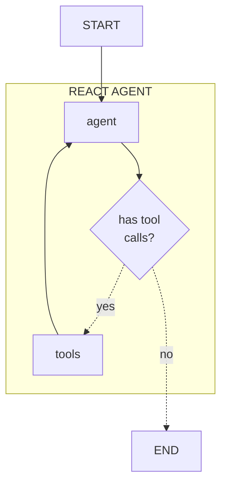
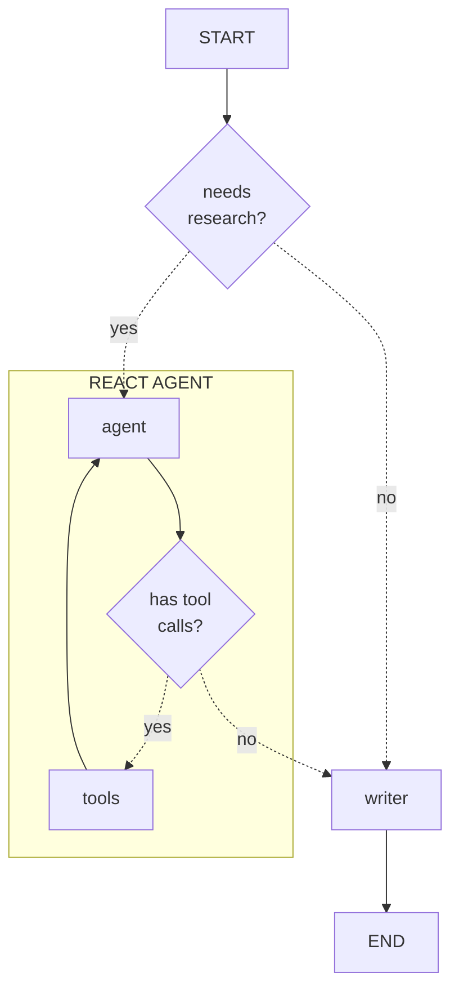

# Learn the Code

Want to make this agent your own? Let's dive into the code!
There are a few components in this agent, but we can break them down, one at a time.

Ready to get started? Let's start off by building the smallest components until we have everything we need.

<!-- fold:break -->

## Available Tools

The first step in creating an agent is defining the tools.
Tools are functions that define the actions an agent can take.
These functions allow agents to interact with external systems.

Your agent will only be able to generate text or perform the tasks defined tools.

We will define our tools in
<button onclick="openOrCreateFileInJupyterLab('code/docgen_agent/tools.py');"><i class="fa-brands fa-python"></i> code/docgen_agent/tools.py</button>.

For our use case, we only need to allow our agent to search Tavily. We have called this tool
<button onclick="goToLineAndSelect('code/docgen_agent/tools.py', 'def search_tavily');"><i class="fas fa-code"></i> search_tavily</button>.
Notice the detailed documentation for this function. This is a [Google formatted docstring](https://google.github.io/styleguide/pyguide.html#383-functions-and-methods) and can be used to define extra metadata for the agent.

Additional tools could be added to this file for use later use by our agent.

<!-- fold:break -->

## Topic Research Agent

Now that our tools are defined, we can create a simple agent to reserach a topic.

One of the simplest architectures for tool calling is called ReAct, short for Reasoning + Action.

In this architecture, the agent will reason what actions to take, preform those actions, and then reason on the next steps.
This is repeated until the agent decides there is no further action to take.

<!-- fold:break -->

This architecture has been implemented for basic research in
<button onclick="openOrCreateFileInJupyterLab('code/docgen_agent/researcher.py');"><i class="fa-brands fa-python"></i> code/docgen_agent/researcher.py</button> and is represented in this diagram.

Each node in the graph is defined by a function in the Python file:
- **agent:** <button onclick="goToLineAndSelect('code/docgen_agent/researcher.py', 'def call_model');"><i class="fas fa-code"></i> call_model</button>
- **tools:** <button onclick="goToLineAndSelect('code/docgen_agent/researcher.py', 'def tool_node');"><i class="fas fa-code"></i> tool_node</button>
- **has tool calls?:** <button onclick="goToLineAndSelect('code/docgen_agent/researcher.py', 'def has_tool_calls');"><i class="fas fa-code"></i> has_tool_calls</button>

The graph is built and saved to
<button onclick="goToLineAndSelect('code/docgen_agent/researcher.py', 'graph =');"><i class="fas fa-code"></i> graph</button>.

<!-- fold:break -->

## Section Author Agent

<!-- fold:break -->

## Top Level Architecture

At a the highest level, the research agent graph is a reasonably linear process. Compare this diagram to the <button onclick="goToLineAndSelect('code/sample_searching_agent/agent.py', 'graph =');"><i class="fas fa-code"></i> graph definition</button> code.

Each node in this graph has an associated function, defined in the same file. Two nodes in our graph are sub-agents.

*researcher agent* is the first node in our graph and is defined in <button onclick="goToLineAndSelect('code/sample_searching_agent/agent.py', 'def topic_research');"><i class="fas fa-code"></i> topic_research</button>. This node invokes the researcher subgraph, that adds topic research to the message log.

<!-- fold:break -->

## Prompts

