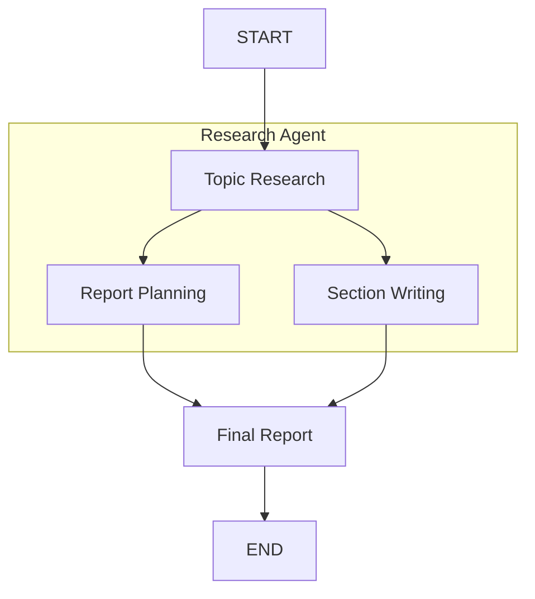

# Report Generation Agent

Meet your AI report writing assistant! The report generation agent automatically researches any topic, creates an outline, writes comprehensive sections, and delivers a complete professional report—all from a single prompt.

## What It Does

Give it any topic and watch the magic happen:
1. **Researches** your topic using web searches
2. **Plans** a logical report structure  
3. **Writes** comprehensive sections
4. **Delivers** a polished final report

No manual research, no writer's block, no formatting headaches!

<!-- fold:break -->

## The Complete Workflow

The report generation agent orchestrates an entire document creation pipeline. See the implementation in 
<button onclick="openOrCreateFileInJupyterLab('code/docgen_agent/agent.py');"><i class="fa-brands fa-python"></i> agent.py</button>:

From **topic** → **research** → **outline** → **writing** → **complete report**

The 
<button onclick="goToLineAndSelect('code/docgen_agent/agent.py', 'async def topic_research');"><i class="fas fa-code"></i> topic_research</button> function kicks off the entire process.

<!-- fold:break -->

## Experience It in Action

<button onclick="openOrCreateFileInJupyterLab('code/researcher_client.ipynb');"><i class="fa-solid fa-flask"></i> Report Agent</button>

See the report generation in action! Prompt the agent to search for information, gather relevant sources, and synthesize its findings. This is your introduction to AI agents that can handle complex, multi-step workflows.
