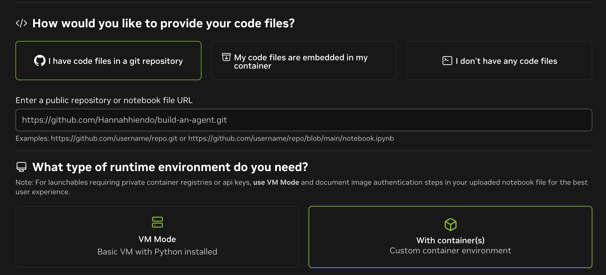
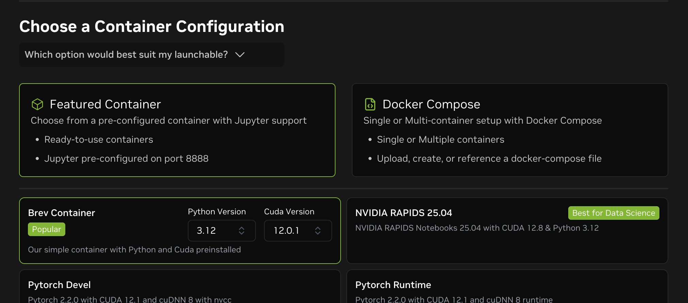
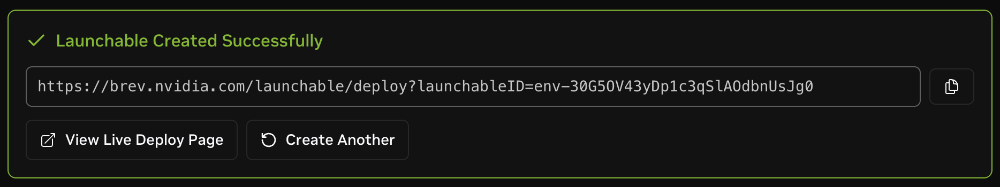

# Share Your Agent
 


Ready to share your AI agent with the world? Let's turn your agent into a Brev launchable so others can use it!

## Step 1: Fork this repo

Before you can publish your changes, you'll need to have your own copy of this repository on GitHub. If you do not have a GitHub account, [sign up for free](https://github.com/join).

Now you can
[<i class="fa-solid fa-code-fork"></i> fork this repo](https://github.com/Hannahhiendo/build-an-agent/fork)
to your own profile! 

<!-- fold:break -->

## Step 2: Open a terminal

For these next steps, we will do a few git commands. Open up a new <button onclick="openNewTerminal();"><i class="fas fa-terminal"></i> terminal</button>.

<!-- fold:break -->

## Step 3: Login to GitHub


In the terminal, we need to login to GitHub so we can push code changes.

To help with this, the GitHub CLI is available.

```bash
gh auth login
```

In the following prompts, select the following options:

```
? What account do you want to log into? GitHub.com
? What is your preferred protocol for Git operations on this host? HTTPS
? Authenticate Git with your GitHub credentials? Yes
? How would you like to authenticate GitHub CLI? Login with a web browser
```

You will be given a one-time code. Type that code into the [GitHub Device Login](https://github.com/login/device) page and follow the prompts to authenticate this machine.

<!-- fold:break -->

## Step 4: Change your Git remote

Now we can tell Git that you would like to start pushing to your own GitHub profile.
Make sure to update the URL in this command with your GitHub Username.

```bash
cd /project
# Change the remote origin to point to your forked repository
git remote set-url origin https://github.com/YOUR_USERNAME/build-an-agent.git
```

<!-- fold:break -->

## Step 5: Commit and Push your Changes

Using git, we will commit our changes. This will locally track the changes that were made.
Then we will push our commits up to GitHub.

```bash
cd /project
git add -A
git commit -m "My first changes."
git push
```

<!-- fold:break -->

## Step 6: Make your Launchable


The fastest way to share any AI Workflow is by creating a Launchable.

Launchables allow you pair your code up with the hardware it needs to run. 
You can then share your Launchable so anyone can run it on their own account.

To get started making your own launchable, open the [Brev Launchable Creator](https://brev.nvidia.com/launchables/create).

<!-- fold:break -->

- Select: `I have my files in a git repository` 
- Enter the URL to your forked repository: `https://github.com/YOUR_USERNAME/build-an-agent.git`
- Select `With container(s)` for the runtime environment



<!-- fold:break -->

- Select `Featured Container` to use a pre-configured container
- Use the `Brev Container` and select a Python Version of `3.12`



<!-- fold:break -->

Click Next to confirm that Jupyter will be the only application by default.

On the next page, select the appropriate GPU profile.

Give your Launchable a name and create it! This will give you a public link to your Launchable. Share it with everyone!


