# 🔗 Connecting Your Git Repository

> **🎯 Core Learning Objective**: Learn how to properly connect your workshop code to a Git repository, enabling version control and seamless Brev launchable deployment.

## 📖 Overview

Connecting your workshop to a Git repository is **essential** for creating Brev launchables. This integration provides:

- **Version Control**: Track changes and collaborate effectively
- **Reproducibility**: Ensure consistent environment builds
- **Automation**: Enable CI/CD workflows
- **Sharing**: Allow others to access and contribute to your work

---

## 🚀 Quick Start: Repository Setup

### Step 1: Initialize Your Repository

If you don't have a Git repository yet:

```bash
# Navigate to your project directory
cd /path/to/your/workshop

# Initialize Git repository
git init

# Add all files
git add .

# Make initial commit
git commit -m "Initial workshop setup"
```

### Step 2: Connect to Remote Repository

Create a repository on your Git platform (GitHub, GitLab, etc.) and connect it:

```bash
# Add remote origin (replace with your repository URL)
git remote add origin https://github.com/yourusername/your-workshop-repo.git

# Push to remote
git branch -M main
git push -u origin main
```

---

## 🔧 Repository Structure for Brev Launchables

Your repository should follow this recommended structure:

```
your-workshop-repo/
├── 📁 .devx/                    # Documentation & workshop content
│   ├── README.md
│   ├── _sidebar.md
│   └── 📁 _static/
├── 📁 code/                     # Your workshop code
│   ├── notebooks/
│   ├── scripts/
│   └── data/
├── 📁 assets/                   # Workshop assets
├── 🐳 compose.yaml              # Docker Compose configuration
├── 🐍 requirements.txt          # Python dependencies
├── 📋 apt.txt                   # System packages
├── ⚙️ variables.env             # Environment variables
├── 🔧 pyproject.toml            # Python project configuration
└── 📜 README.md                 # Project overview
```

---

## 🔐 Essential Files for Launchables

### 1. **compose.yaml** - Container Configuration

```yaml
services:
  my-app:
    hostname: my-app
    image: nvidia/cuda:12.0-devel-ubuntu20.04
    runtime: nvidia
    restart: unless-stopped
    ports:
      - "8080:8080"   # Application port
      - "8888:8888"   # Jupyter port
    environment:
      - CUDA_VISIBLE_DEVICES=0
      - NGC_API_KEY=${NGC_API_KEY}
    volumes:
      - app-data:/workspace
    deploy:
      resources:
        reservations:
          devices:
            - driver: nvidia
              device_ids: ["0"]
```

### 2. **requirements.txt** - Python Dependencies

```txt
jupyter
numpy
pandas
torch
transformers
```

### 3. **variables.env** - Environment Variables

```env
# API Keys (will be injected by Brev)
NGC_API_KEY=
OPENAI_API_KEY=

# Application Settings
APP_MODE=workshop
DEBUG=false
```

---

## 🏗️ Pre-Launchable Checklist

Before creating your Brev launchable, ensure your repository has:

- [ ] **📋 Clear README.md** with setup instructions
- [ ] **🐳 compose.yaml** with proper GPU configuration
- [ ] **🐍 requirements.txt** with all Python dependencies
- [ ] **📁 Organized code structure** in dedicated directories
- [ ] **🔒 No sensitive data** (API keys, passwords) committed
- [ ] **✅ All code tested** and working locally
- [ ] **📚 Documentation** for workshop participants

---

## 🔄 Git Workflow Best Practices

### Branch Strategy
```bash
# Create feature branches for new content
git checkout -b feature/new-workshop-module
git add .
git commit -m "Add structured report generation module"
git push origin feature/new-workshop-module

# Merge back to main after review
git checkout main
git merge feature/new-workshop-module
```

### Commit Message Format
```bash
# Use descriptive commit messages
git commit -m "feat: add git repository setup documentation"
git commit -m "fix: correct Docker GPU configuration"
git commit -m "docs: update workshop prerequisites"
```

---

## 🚀 Repository → Launchable Workflow

```mermaid
graph LR
    A[📝 Code Development] --> B[📁 Git Repository]
    B --> C[🔧 Configure compose.yaml]
    C --> D[📋 Update requirements.txt]
    D --> E[🚀 Create Brev Launchable]
    E --> F[✅ Deploy & Test]
    F --> G[👥 Share with Workshop Participants]
```



---

## 🛠️ Advanced Repository Configuration

### Environment-Specific Configurations

Create different configurations for development vs. production:

```yaml
# compose.yaml - Base configuration
services:
  my-app:
    profiles: ["base"]
    # ... base configuration

  my-app-dev:
    extends:
      service: my-app
    profiles: ["dev"]
    environment:
      - DEBUG=true
      - LOG_LEVEL=debug

  my-app-prod:
    extends:
      service: my-app
    profiles: ["prod"]
    environment:
      - DEBUG=false
      - LOG_LEVEL=info
```

### Pre-commit Hooks

Set up automated checks:

```bash
# Install pre-commit
pip install pre-commit

# Create .pre-commit-config.yaml
cat > .pre-commit-config.yaml << EOF
repos:
  - repo: https://github.com/pre-commit/pre-commit-hooks
    rev: v4.4.0
    hooks:
      - id: trailing-whitespace
      - id: end-of-file-fixer
      - id: check-yaml
      - id: check-added-large-files
EOF

# Install hooks
pre-commit install
```

---

## 🆘 Common Issues & Solutions

| Problem | Solution |
|---------|----------|
| **Large files in Git** | Use Git LFS: `git lfs track "*.data"` |
| **Sensitive data committed** | Use `.gitignore` and `git-secrets` |
| **Docker build fails** | Check `compose.yaml` syntax and dependencies |
| **Missing dependencies** | Update `requirements.txt` and test locally |

---

## ✅ Verification Steps

Before proceeding to launchable creation:

1. **Clone Test**: Can you clone and run your repository fresh?
   ```bash
   git clone https://github.com/yourusername/your-repo.git
   cd your-repo
   docker-compose up
   ```

2. **Dependency Check**: Are all requirements installable?
   ```bash
   pip install -r requirements.txt
   ```

3. **Documentation Review**: Is your setup clearly documented?

---

## 🔗 Next Steps

Once your repository is properly configured:

1. 📦 **[Understanding Launchables](understanding-launchables.md)** - Learn about Brev launchables
2. 🏗️ **[Building Your Launchable](building-launchable.md)** - Create your first launchable
3. 🚀 **[Deploying to Brev Platform](deploying-launchable.md)** - Deploy and share

---

> **💡 Pro Tip**: Start with a simple repository structure and iterate. It's easier to add complexity than to untangle a complex setup later! 