# 🔗 Setting Up Your Public GitHub Repository

> **🎯 Goal**: Create a public GitHub repository that will house your modified notebook and enable Brev launchable creation.

## 🔑 Key Requirement: Public Repository Only

**⚠️ IMPORTANT**: Brev launchables can **only** be created from **public GitHub repositories**. Private repositories won't work!

---

## 🚀 Quick Setup for College Students

### Step 1: Create Your Public GitHub Repository

1. **Go to GitHub.com** and sign in (create account if needed)
2. **Click the "+" icon** in the top right corner
3. **Select "New repository"**
4. **Fill out the details**:
   - **Repository name**: `my-creative-agent` (or something descriptive)
   - **Description**: "Creative AI agent with structured report generation"
   - **🔓 Set to PUBLIC** ← This is crucial!
   - **✅ Check "Add a README file"**
   - **Choose a license** (MIT is a good default for students)

### Step 2: Clone to Your Local Machine

```bash
# Replace with your actual repository URL
git clone https://github.com/yourusername/my-creative-agent.git
cd my-creative-agent
```

---

## 📁 Repository Structure for Your Agent

Here's how to organize your creative agent repository:

```
my-creative-agent/
├── 📓 agent.ipynb                   # Your modified workshop notebook
├── 📁 data/                         # Any sample data files
├── 📁 outputs/                      # Generated reports/examples
├── 🐳 compose.yaml                  # Docker configuration for Brev
├── 🐍 requirements.txt              # Python packages needed
├── 📋 apt.txt                       # System packages (if needed)
├── ⚙️ variables.env                 # Environment variables
└── 📜 README.md                     # Project description
```

---

## 📝 Essential Files You'll Need

### 1. **requirements.txt** - Your Python Dependencies

Create this file with the packages your agent needs:

```txt
jupyter
notebook
pandas
numpy
matplotlib
requests
openai
python-dotenv
```

### 2. **compose.yaml** - Container Configuration

```yaml
services:
  creative-agent:
    hostname: creative-agent
    image: nvidia/cuda:12.0-devel-ubuntu20.04
    runtime: nvidia
    restart: unless-stopped
    ports:
      - "8888:8888"   # Jupyter notebook
      - "8080:8080"   # Your agent app (if needed)
    environment:
      - CUDA_VISIBLE_DEVICES=0
      - OPENAI_API_KEY=${OPENAI_API_KEY}
      - NGC_API_KEY=${NGC_API_KEY}
    volumes:
      - agent-data:/workspace
    deploy:
      resources:
        reservations:
          devices:
            - driver: nvidia
              device_ids: ["0"]

volumes:
  agent-data:
```

### 3. **variables.env** - Environment Variables

```env
# API Keys (Brev will inject these)
OPENAI_API_KEY=
NGC_API_KEY=

# Your agent settings
AGENT_NAME=MyCreativeAgent
DEBUG=true
```

### 4. **README.md** - Showcase Your Work!

```markdown
# My Creative AI Agent

## What it does
[Describe your creative agent and what makes it special]

## How to run
1. Click the Brev launchable link below
2. Open the Jupyter notebook
3. Run all cells to see the magic!

## Launchable Link
🚀 [Run My Agent](your-brev-link-will-go-here)

## Sample Output
[Include screenshots or examples of your agent's reports]
```

---

## 🔄 Your Development Workflow

Here's the cycle you'll follow during the workshop:

```mermaid
graph LR
    A[📓 Modify Notebook] --> B[💾 Save Changes]
    B --> C[📤 Push to GitHub]
    C --> D[🚀 Update Launchable]
    D --> E[✅ Test & Share]
    E --> A
```



### The Commands You'll Use:

```bash
# After modifying your notebook in the workshop
git add .
git commit -m "Enhanced my creative agent with [describe your changes]"
git push origin main

# Your Brev launchable will automatically update!
```

---

## 🎨 Making Your Repository Stand Out

### Add Visual Appeal
- **Screenshots** of your agent in action
- **Sample reports** your agent generates
- **Creative examples** showing different use cases

### Professional Touch
- Clear **project description**
- **Instructions** for others to use your agent
- **License** (shows you understand open source)
- **Links** to your launchable for easy access

### Portfolio Value
This repository can be:
- **Added to your resume** as a project
- **Shared with potential employers**
- **Used as a portfolio piece**
- **Extended for future projects**

---

## ✅ Pre-Launchable Checklist

Before creating your Brev launchable, ensure:

- [ ] ✅ Repository is **PUBLIC**
- [ ] 📓 Your modified notebook is committed and pushed
- [ ] 🐍 `requirements.txt` includes all needed packages
- [ ] 🐳 `compose.yaml` is properly configured
- [ ] 📋 README describes your creative agent
- [ ] 🧪 Everything works when you clone fresh

---

## 🚨 Common Student Gotchas

| Problem | Solution |
|---------|----------|
| **Repository is private** | Change to public in Settings → Danger Zone |
| **Forgot to push changes** | `git push origin main` |
| **Missing dependencies** | Add to `requirements.txt` |
| **Notebook won't run** | Test locally first! |
| **Large files committed** | Use `.gitignore` for data files |

---

## 🔒 Advanced: Professional Secrets Management (Optional)

> **👨‍💻 For Future Learning**: Once you're comfortable with the basics, consider exploring professional secrets management.

If you want to learn industry-standard secrets management, check out the [jupyter-secrets-manager extension](https://github.com/jupyterlab-contrib/jupyter-secrets-manager). This tool helps:

- **Auto-fill API keys** in notebook inputs
- **Prevent accidental commits** of sensitive data  
- **Manage secrets securely** during development

**Installation** (for advanced users):
```bash
pip install jupyter_secrets_manager
```

This extension can automatically manage your `NGC_API_KEY` and `OPENAI_API_KEY` without manual copying, making your development workflow more professional and secure.

*Note: This is experimental software, so stick with the basic approach for your workshop project, but it's great to know about for future work!*

---

## 🔗 Next Steps

Once your repository is set up:

1. 📤 **[Moving Your Notebook to Git](notebook-to-git.md)** - Get your work into the repo
2. 🚀 **[Creating Your Brev Launchable](creating-brev-launchable.md)** - Deploy to the world!

---

> **💡 Pro Tip**: Make your repository README awesome! Future employers love seeing well-documented projects that show your creativity and technical skills. 